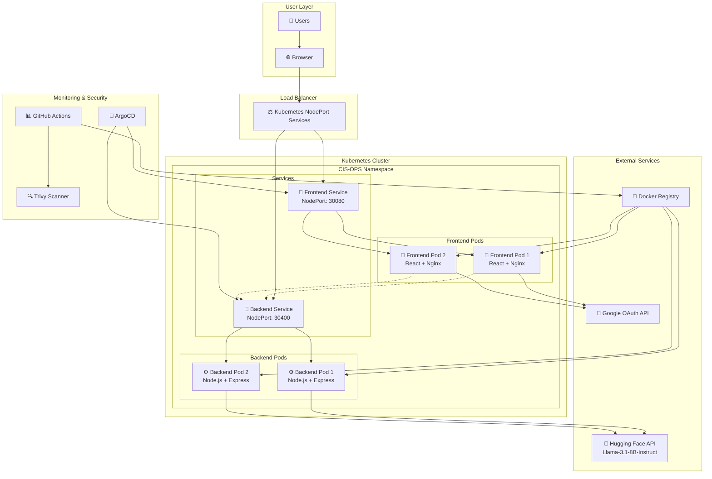
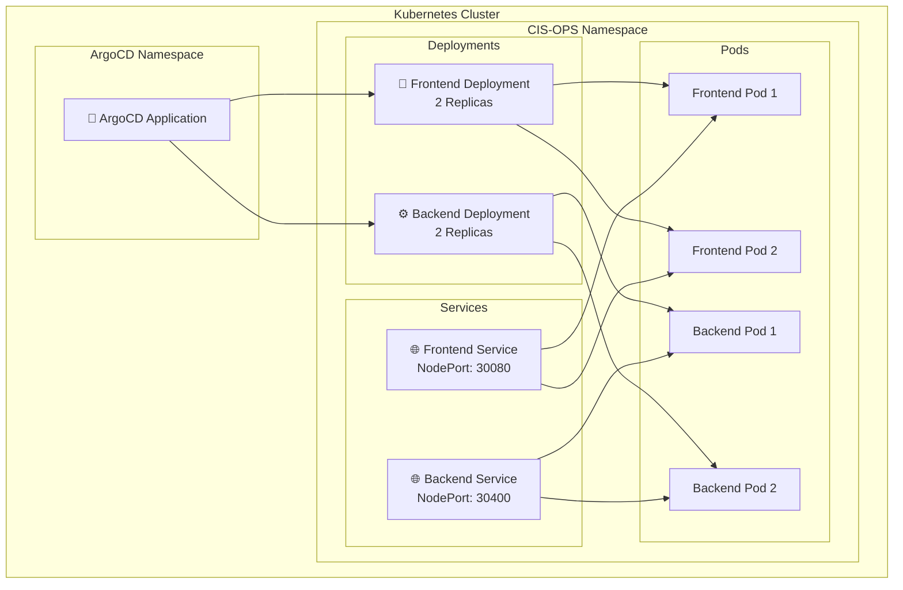
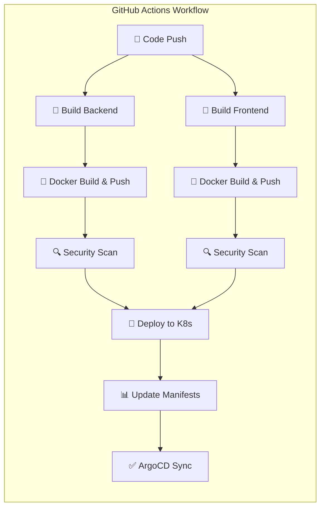

# CIS Operations Dashboard & AI Assistant

A comprehensive system monitoring and management platform with AI-powered chat assistance, built with modern DevOps practices and containerized deployment.

## 🏗️ Architecture Overview



## 🚀 Features

### 📊 **System Monitoring Dashboard**
- Real-time CPU, Memory, Disk, and Network metrics
- System health monitoring with visual indicators
- Live connection status and automatic reconnection
- Kubernetes cluster status (when deployed)

### 🤖 **AI-Powered Assistant**
- Integrated Llama-3.1-8B-Instruct model via Hugging Face
- Context-aware responses for IT operations
- Real-time chat interface with typing indicators
- Suggested questions for quick access

### 👥 **User Management**
- Google OAuth integration for secure authentication
- Role-based access control (Admin/User)
- User creation, editing, and deletion
- Activity tracking and status management

### 🔐 **Security & Compliance**
- Container vulnerability scanning with Trivy
- Multi-factor authentication via Google OAuth
- Security headers and CORS protection
- Encrypted data transmission

## 🛠️ Technology Stack

### Frontend
- **React 18** - Modern UI framework
- **Tailwind CSS** - Utility-first styling
- **Socket.io Client** - Real-time communication
- **React Router** - Client-side routing
- **Google OAuth** - Authentication

### Backend
- **Node.js** - Runtime environment
- **Express.js** - Web framework
- **Socket.io** - WebSocket communication
- **CORS** - Cross-origin resource sharing

### DevOps & Infrastructure
- **Docker** - Containerization
- **Kubernetes** - Container orchestration
- **GitHub Actions** - CI/CD pipeline
- **ArgoCD** - GitOps deployment
- **Trivy** - Security scanning

## 📋 Prerequisites

- **Node.js** 18+ and npm
- **Docker** and Docker Compose
- **Kubernetes** cluster (for production)
- **Google OAuth** credentials
- **Hugging Face** API key

## 🔧 Quick Start

### 1. Clone the Repository
```bash
git clone https://github.com/your-repo/cis-ops-app.git
cd cis-ops-app
```

### 2. Environment Setup
Create environment files:

**Frontend (.env in `frontend/`):**
```env
REACT_APP_HF_API_KEY=your_hugging_face_api_key
REACT_APP_GOOGLE_CLIENT_ID=your_google_client_id
REACT_APP_BACKEND_URL=http://localhost:4000
```

### 3. Development Mode

**Backend:**
```bash
cd backend
npm install
npm start
# Server runs on http://localhost:4000
```

**Frontend:**
```bash
cd frontend
npm install
npm start
# App runs on http://localhost:3000
```

### 4. Docker Deployment
```bash
# Build and run with Docker Compose
docker-compose up --build

# Or individual containers
docker build -t cis-ops-backend ./backend
docker build -t cis-ops-frontend ./frontend

docker run -p 4000:4000 cis-ops-backend
docker run -p 3000:80 cis-ops-frontend
```

## ☸️ Kubernetes Deployment

### Architecture in Kubernetes



### Deploy to Kubernetes
```bash
# Apply Kubernetes manifests
kubectl apply -f k8s/manifests/

# Or use ArgoCD for GitOps
kubectl apply -f k8s/argocd-application.yaml
```

### Access the Application
- **Frontend:** `http://your-cluster-ip:30080`
- **Backend:** `http://your-cluster-ip:30400`

## 🔄 CI/CD Pipeline



The CI/CD pipeline automatically:
1. **Builds** both frontend and backend
2. **Creates** and pushes Docker images
3. **Scans** for vulnerabilities with Trivy
4. **Updates** Kubernetes manifests
5. **Triggers** ArgoCD deployment

## 🔐 Security Features

### Container Security
- **Trivy scanning** for vulnerabilities
- **Non-root user** execution
- **Multi-stage builds** for minimal attack surface
- **Security headers** in Nginx configuration

### Authentication & Authorization
- **Google OAuth 2.0** integration
- **JWT token** validation
- **Role-based access** control
- **Secure session** management

### Network Security
- **CORS** protection configured
- **HTTPS** ready (certificate required)
- **Network policies** for pod communication
- **Service mesh** ready architecture

## 📊 Monitoring & Observability

### System Metrics
- **CPU Usage** - Real-time processor utilization
- **Memory Usage** - RAM consumption monitoring
- **Disk Usage** - Storage utilization tracking
- **Network Traffic** - Bandwidth monitoring

### Health Checks
- **Liveness probes** - Container health monitoring
- **Readiness probes** - Service availability checks
- **Backend health** endpoint (`/health`)
- **Frontend health** endpoint (`/health`)

### Real-time Updates
- **WebSocket connection** for live metrics
- **Polling fallback** when WebSocket fails
- **Connection status** indicators
- **Automatic reconnection** logic

## 🎯 API Endpoints

### Backend API
| Method | Endpoint | Description |
|--------|----------|-------------|
| GET | `/health` | Health check |
| GET | `/api/health` | Detailed health status |
| GET | `/api/metrics` | System metrics |
| GET | `/api/users` | Get all users |
| POST | `/api/users` | Create new user |
| PUT | `/api/users/:id` | Update user |
| DELETE | `/api/users/:id` | Delete user |

### WebSocket Events
| Event | Direction | Description |
|-------|-----------|-------------|
| `connect` | Client → Server | WebSocket connection |
| `metrics` | Server → Client | Real-time metrics data |
| `disconnect` | Client ↔ Server | Connection termination |

## 🚨 Troubleshooting

### Common Issues

**Frontend can't connect to backend:**
```bash
# Check if backend is running
curl http://localhost:4000/health

# Verify environment variables
echo $REACT_APP_BACKEND_URL
```

**WebSocket connection fails:**
- Check firewall settings for port 4000
- Verify CORS configuration in backend
- Try polling fallback mode

**Kubernetes deployment issues:**
```bash
# Check pod status
kubectl get pods -n cis-ops

# View pod logs
kubectl logs -n cis-ops deployment/cis-ops-backend
kubectl logs -n cis-ops deployment/cis-ops-frontend

# Check service endpoints
kubectl get svc -n cis-ops
```

**Authentication not working:**
- Verify Google OAuth client ID
- Check redirect URLs in Google Console
- Ensure proper domain configuration

## 🏷️ Project Structure

```
cis-ops-app/
├── 📁 backend/                    # Node.js backend service
│   ├── 📄 server.js              # Main server file
│   ├── 📄 metrics.js             # System metrics collection
│   ├── 📄 Dockerfile             # Backend container config
│   └── 📄 package.json           # Backend dependencies
├── 📁 frontend/                   # React frontend application
│   ├── 📁 src/
│   │   ├── 📁 components/        # Reusable UI components
│   │   ├── 📁 pages/             # Page components
│   │   ├── 📁 context/           # React context providers
│   │   └── 📁 api/               # API integration
│   ├── 📄 Dockerfile             # Frontend container config
│   ├── 📄 nginx.conf             # Nginx configuration
│   └── 📄 package.json           # Frontend dependencies
├── 📁 k8s/                       # Kubernetes manifests
│   ├── 📁 manifests/             # Deployment configurations
│   └── 📄 argocd-application.yaml # ArgoCD application
├── 📁 .github/workflows/         # CI/CD pipeline
│   └── 📄 ci.yml                 # GitHub Actions workflow
└── 📄 README.md                  # Project documentation
```

## 🤝 Contributing

1. **Fork** the repository
2. **Create** a feature branch (`git checkout -b feature/amazing-feature`)
3. **Commit** your changes (`git commit -m 'Add amazing feature'`)
4. **Push** to the branch (`git push origin feature/amazing-feature`)
5. **Open** a Pull Request

### Development Guidelines
- Follow **ESLint** configuration
- Write **unit tests** for new features
- Update **documentation** for API changes
- Test **Docker builds** before submitting

## 📄 License

This project is licensed under the MIT License - see the [LICENSE](LICENSE) file for details.

## 🙏 Acknowledgments

- **Hugging Face** for AI model API
- **Google** for OAuth integration
- **Kubernetes** community for orchestration
- **ArgoCD** for GitOps deployment
- **React** and **Node.js** communities

## 📞 Support

For support and questions:
- 📧 **Email:** support@cisops.com
- 📖 **Documentation:** [Wiki](https://github.com/sayan8967/cis-ops-app/wiki)
- 🐛 **Issues:** [GitHub Issues](https://github.com/sayan8967/cis-ops-app/issues)
- 💬 **Discussions:** [GitHub Discussions](https://github.com/sayan8967/cis-ops-app/discussions)

## 🔮 Roadmap

### Version 2.0 (Planned)
- [ ] **Database integration** (PostgreSQL/MongoDB)
- [ ] **Advanced monitoring** with Prometheus/Grafana
- [ ] **Log aggregation** with ELK stack
- [ ] **Multi-tenant** support
- [ ] **API rate limiting**
- [ ] **Automated scaling** based on metrics

### Version 2.1 (Future)
- [ ] **Mobile application**
- [ ] **Advanced AI features**
- [ ] **Custom dashboards**
- [ ] **Third-party integrations**
- [ ] **Audit logging**
- [ ] **Backup and restore**

---

**Made with ❤️ by Sayan Banerjee**

> This project demonstrates modern DevOps practices including containerization, orchestration, CI/CD, security scanning, and GitOps deployment.