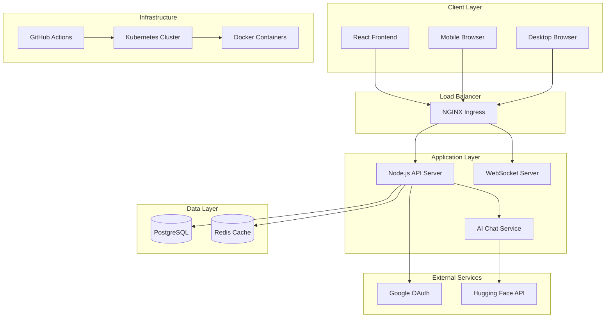
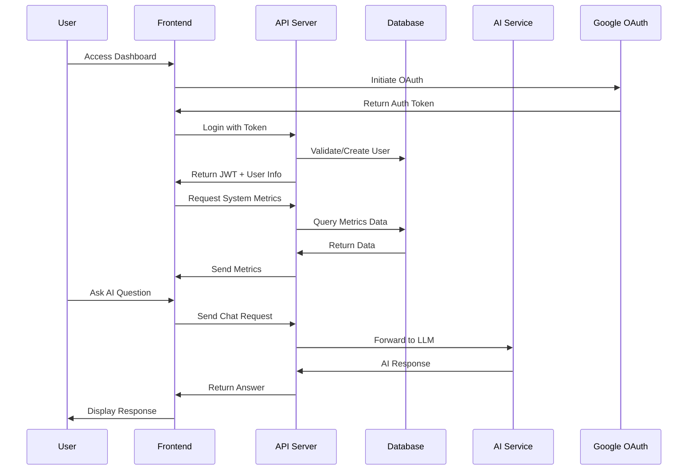

# 🚀 CIS Operations Dashboard

[](https://github.com/sayan8967/cis-ops)
[](https://github.com/sayan8967/cis-ops)
[](LICENSE)
[](https://hub.docker.com/)
[](https://kubernetes.io/)

> **A modern, enterprise-grade system operations dashboard with AI-powered assistance, real-time monitoring, and comprehensive user management.**

---

## 📋 Table of Contents

- [🎯 Overview](#-overview)
- [✨ Features](#-features)
- [🏗️ Architecture](#️-architecture)
- [🚀 Quick Start](#-quick-start)
- [📦 Installation](#-installation)
- [🔧 Configuration](#-configuration)
- [🐳 Docker Deployment](#-docker-deployment)
- [☸️ Kubernetes Deployment](#️-kubernetes-deployment)
- [📊 Monitoring & Analytics](#-monitoring--analytics)
- [🔐 Security](#-security)
- [🧪 Testing](#-testing)
- [📖 API Documentation](#-api-documentation)
- [🛠️ Troubleshooting](#️-troubleshooting)
- [🤝 Contributing](#-contributing)
- [📄 License](#-license)

---

## 🎯 Overview

**CIS Operations Dashboard** is a cutting-edge system management platform that combines the power of AI assistance with comprehensive system monitoring and user management. Built with modern technologies and enterprise-grade security, it provides a centralized hub for IT operations teams.

### 🌟 Why CIS Operations?

- **🤖 AI-Powered**: Integrated LLM assistant for instant IT support and troubleshooting
- **📊 Real-Time Monitoring**: Live system metrics with beautiful visualizations
- **👥 Advanced User Management**: Role-based access control with granular permissions
- **🔒 Enterprise Security**: Google OAuth integration with JWT authentication
- **📱 Responsive Design**: Works seamlessly on desktop, tablet, and mobile
- **☸️ Cloud Native**: Kubernetes-ready with automated CI/CD pipelines
- **🎨 Modern UI**: Beautiful, intuitive interface built with React and Tailwind CSS

---

## ✨ Features

### 🤖 AI Operations Assistant
- **Intelligent Chat Interface**: Natural language interaction with specialized IT knowledge
- **Real-Time Troubleshooting**: Instant solutions for common system issues
- **Performance Analysis**: AI-driven insights into system metrics and trends
- **Security Guidance**: Best practices and security recommendations

### 📊 System Monitoring
- **Live Metrics Dashboard**: CPU, Memory, Disk, and Network monitoring
- **Historical Analytics**: Track performance trends over time
- **Custom Alerts**: Configurable thresholds and notifications
- **Multi-System Support**: Monitor multiple servers from one interface

### 👥 User Management
- **Role-Based Access Control**: Admin, Moderator, and User roles
- **User Lifecycle Management**: Create, update, deactivate users
- **Activity Tracking**: Monitor user login patterns and system access
- **Permission Matrix**: Granular control over feature access

### 🔐 Security & Authentication
- **Google OAuth Integration**: Secure, enterprise-grade authentication
- **JWT Token Management**: Stateless authentication with automatic refresh
- **Session Management**: Secure session handling and logout
- **Audit Logging**: Track all user activities and system changes

---

## 🏗️ Architecture

### System Overview



### Technology Stack

#### Frontend (React.js)
```
📦 Frontend Architecture
├── 🎨 UI Framework: React 18 + TypeScript
├── 🎭 Styling: Tailwind CSS
├── 🛣️ Routing: React Router v6
├── 🔄 State Management: Context API
├── 🔐 Authentication: Google OAuth
├── 📡 HTTP Client: Axios
└── 🔌 Real-time: Socket.io Client
```

#### Backend (Node.js)
```
📦 Backend Architecture
├── 🚀 Runtime: Node.js 18+
├── 🌐 Framework: Express.js
├── 🗄️ Database: PostgreSQL 15
├── 🔐 Authentication: JWT + Google OAuth
├── 📊 Monitoring: Custom Metrics
├── 🔌 WebSockets: Socket.io
└── 🤖 AI Integration: Hugging Face API
```

#### Infrastructure
```
📦 Infrastructure Stack
├── 🐳 Containerization: Docker
├── ☸️ Orchestration: Kubernetes
├── 🔄 CI/CD: GitHub Actions
├── 🌐 Reverse Proxy: NGINX
├── 📊 Monitoring: Prometheus (planned)
└── 📝 Logging: ELK Stack (planned)
```

### Data Flow Architecture



---

## 🚀 Quick Start

### Prerequisites

- **Node.js** 18+ and npm
- **Docker** and Docker Compose
- **Kubernetes** cluster (for production)
- **PostgreSQL** 15+ (or use Docker)
- **Google OAuth** credentials
- **Hugging Face** API key

### 🏃‍♂️ One-Command Setup

```bash
# Clone and start the entire stack
git clone https://github.com/your-repo/cis-ops.git
cd cis-ops
./scripts/quick-start.sh
```

### 🎯 Manual Setup (3 minutes)

1. **Clone the repository**
```bash
git clone https://github.com/your-repo/cis-ops.git
cd cis-ops
```

2. **Set up environment variables**
```bash
cp .env.example .env
# Edit .env with your configuration
```

3. **Start with Docker Compose**
```bash
docker-compose up --build
```

4. **Access the application**
- Frontend: http://localhost:3000
- Backend API: http://localhost:4000
- Health Check: http://localhost:4000/api/health

---

## 📦 Installation

### Development Setup

#### Backend Setup
```bash
cd backend
npm install

# Environment variables
cp .env.example .env
# Configure your .env file:
# - Database credentials
# - Google OAuth credentials
# - JWT secret
# - Hugging Face API key

# Start PostgreSQL (using Docker)
docker run --name cis-ops-db -e POSTGRES_PASSWORD=cisops123 -e POSTGRES_DB=cisops -p 5432:5432 -d postgres:15

# Run database migrations
npm run migrate

# Start development server
npm run dev
```

#### Frontend Setup
```bash
cd frontend
npm install

# Environment variables
cp .env.example .env
# Configure:
# - REACT_APP_GOOGLE_CLIENT_ID
# - REACT_APP_HF_API_KEY
# - REACT_APP_BACKEND_URL (optional)

# Start development server
npm start
```

### Production Setup

#### Using Docker Compose
```bash
# Production with Docker Compose
docker-compose -f docker-compose.prod.yml up --build -d
```

#### Manual Production Setup
```bash
# Build frontend
cd frontend
npm run build

# Build backend
cd ../backend
npm ci --production

# Start with PM2
npm install -g pm2
pm2 start ecosystem.config.js
```

---

## 🔧 Configuration

### Environment Variables

#### Backend (.env)
```bash
# Server Configuration
NODE_ENV=production
PORT=4000

# Database
DB_HOST=localhost
DB_PORT=5432
DB_NAME=cisops
DB_USER=cisops
DB_PASSWORD=your-secure-password

# Authentication
JWT_SECRET=your-super-secret-jwt-key-change-in-production
JWT_EXPIRES_IN=24h

# Google OAuth
GOOGLE_CLIENT_ID=your-google-client-id
GOOGLE_CLIENT_SECRET=your-google-client-secret

# External APIs
HF_API_KEY=your-hugging-face-api-key

# Optional: Redis for caching
REDIS_URL=redis://localhost:6379
```

#### Frontend (.env)
```bash
# Google OAuth
REACT_APP_GOOGLE_CLIENT_ID=your-google-client-id

# AI Service
REACT_APP_HF_API_KEY=your-hugging-face-api-key

# API Configuration (optional, defaults to relative URLs)
REACT_APP_BACKEND_URL=http://localhost:4000

# Feature Flags
REACT_APP_ENABLE_WEBSOCKETS=true
REACT_APP_ENABLE_AI_CHAT=true
```

### Database Configuration

#### PostgreSQL Setup
```sql
-- Create database and user
CREATE DATABASE cisops;
CREATE USER cisops WITH PASSWORD 'your-secure-password';
GRANT ALL PRIVILEGES ON DATABASE cisops TO cisops;

-- Connect to cisops database
\c cisops

-- Enable extensions (if needed)
CREATE EXTENSION IF NOT EXISTS "uuid-ossp";
```

#### Database Schema
The application automatically creates and migrates database tables on startup:

- **users**: User accounts with roles and metadata
- **metrics**: System performance metrics history
- **system_info**: System information and status
- **sessions**: User session management (optional)

---

## 🐳 Docker Deployment

### Development with Docker Compose
```yaml
# docker-compose.yml
version: '3.8'
services:
  postgres:
    image: postgres:15-alpine
    environment:
      POSTGRES_DB: cisops
      POSTGRES_USER: cisops
      POSTGRES_PASSWORD: cisops123
    ports:
      - "5432:5432"
    volumes:
      - postgres_data:/var/lib/postgresql/data

  backend:
    build: ./backend
    environment:
      - NODE_ENV=development
      - DB_HOST=postgres
    ports:
      - "4000:4000"
    depends_on:
      - postgres
    volumes:
      - ./backend:/app
      - /app/node_modules

  frontend:
    build: ./frontend
    ports:
      - "3000:80"
    depends_on:
      - backend

volumes:
  postgres_data:
```

### Production Docker Setup
```bash
# Build production images
docker build -t cis-ops-backend:latest ./backend
docker build -t cis-ops-frontend:latest ./frontend

# Push to registry
docker tag cis-ops-backend:latest your-registry/cis-ops-backend:latest
docker push your-registry/cis-ops-backend:latest

docker tag cis-ops-frontend:latest your-registry/cis-ops-frontend:latest
docker push your-registry/cis-ops-frontend:latest
```

### Multi-Stage Dockerfile Examples

#### Backend Dockerfile
```dockerfile
# backend/Dockerfile
FROM node:18-alpine AS base
WORKDIR /app
RUN apk add --no-cache curl postgresql-client

FROM base AS dependencies
COPY package*.json ./
RUN npm ci --only=production

FROM base AS build
COPY package*.json ./
RUN npm ci
COPY . .
RUN npm run build

FROM base AS production
COPY --from=dependencies /app/node_modules ./node_modules
COPY --from=build /app/dist ./dist
COPY package*.json ./

RUN addgroup -g 1001 -S nodejs && \
    adduser -S backend -u 1001 -G nodejs && \
    chown -R backend:nodejs /app

USER backend
EXPOSE 4000

HEALTHCHECK --interval=30s --timeout=10s --start-period=40s --retries=3 \
  CMD curl -f http://localhost:4000/api/health || exit 1

CMD ["node", "dist/server.js"]
```

---

## ☸️ Kubernetes Deployment

### Kubernetes Manifests

The project includes complete Kubernetes deployment manifests in the `k8s/` directory:

```
k8s/
├── manifests/
│   ├── namespace.yaml
│   ├── backend-configmap.yaml
│   ├── backend-deployment.yaml
│   ├── backend-service.yaml
│   ├── frontend-deployment.yaml
│   ├── frontend-service.yaml
│   └── postgres-deployment.yaml
└── argocd-application.yaml
```

### Automated Deployment

The project uses **ArgoCD** for GitOps-based continuous deployment:

1. **Commit to main/release branch**
2. **GitHub Actions builds and pushes images**
3. **ArgoCD syncs Kubernetes manifests**
4. **Automatic rollout with health checks**

### Manual Kubernetes Deployment

```bash
# Create namespace
kubectl apply -f k8s/manifests/namespace.yaml

# Deploy PostgreSQL
kubectl apply -f k8s/manifests/postgres-deployment.yaml

# Deploy backend
kubectl apply -f k8s/manifests/backend-configmap.yaml
kubectl apply -f k8s/manifests/backend-deployment.yaml
kubectl apply -f k8s/manifests/backend-service.yaml

# Deploy frontend
kubectl apply -f k8s/manifests/frontend-deployment.yaml
kubectl apply -f k8s/manifests/frontend-service.yaml

# Check deployment status
kubectl get pods -n cis-ops
kubectl get services -n cis-ops
```

### Accessing the Application

```bash
# Port forward for local access
kubectl port-forward -n cis-ops service/cis-ops-frontend-service 8080:80
kubectl port-forward -n cis-ops service/cis-ops-backend-service 8081:4000

# Or access via NodePort (if configured)
# Frontend: http://your-cluster-ip:30080
# Backend: http://your-cluster-ip:30400
```

---

## 📊 Monitoring & Analytics

### Built-in Monitoring

The application includes comprehensive monitoring capabilities:

#### System Metrics
- **CPU Usage**: Real-time and historical CPU utilization
- **Memory Usage**: RAM consumption with alerts
- **Disk Usage**: Storage utilization across volumes
- **Network Activity**: Bandwidth usage and connection stats

#### Application Metrics
- **User Activity**: Login patterns and feature usage
- **API Performance**: Response times and error rates
- **Chat Analytics**: AI assistant usage patterns
- **System Health**: Service status and uptime

### Integration with External Tools

#### Prometheus Integration (Planned)
```yaml
# prometheus-config.yaml
apiVersion: v1
kind: ConfigMap
metadata:
  name: prometheus-config
data:
  prometheus.yml: |
    scrape_configs:
    - job_name: 'cis-ops-backend'
      static_configs:
      - targets: ['cis-ops-backend-service:4000']
      metrics_path: '/api/metrics/prometheus'
```

#### Grafana Dashboard (Planned)
- Pre-built dashboards for system metrics
- User activity analytics
- AI chat performance metrics
- Custom alerting rules

---

## 🔐 Security

### Authentication & Authorization

#### Google OAuth Integration
- **Secure Authentication**: Enterprise-grade OAuth 2.0
- **Token Management**: JWT tokens with automatic refresh
- **Role-Based Access**: Admin, Moderator, User roles
- **Session Security**: Secure session handling and logout

#### Security Features
- **CORS Protection**: Configured for production environments
- **Input Validation**: Comprehensive request validation
- **SQL Injection Prevention**: Parameterized queries
- **XSS Protection**: Content Security Policy headers
- **Rate Limiting**: API endpoint protection (planned)

### Security Best Practices

1. **Environment Variables**: Never commit secrets to version control
2. **HTTPS Only**: Use SSL/TLS in production
3. **Database Security**: Use strong passwords and limit access
4. **Container Security**: Run containers as non-root users
5. **Network Security**: Use Kubernetes network policies

### Security Configuration

```bash
# Generate strong JWT secret
openssl rand -base64 32

# Create Kubernetes secrets
kubectl create secret generic cis-ops-secrets \
  --from-literal=jwt-secret="your-jwt-secret" \
  --from-literal=db-password="your-db-password" \
  --from-literal=google-client-secret="your-google-secret"
```

---

## 🧪 Testing

### Test Structure
```
tests/
├── backend/
│   ├── unit/
│   │   ├── auth.test.js
│   │   ├── metrics.test.js
│   │   └── users.test.js
│   ├── integration/
│   │   ├── api.test.js
│   │   └── database.test.js
│   └── e2e/
│       └── workflow.test.js
├── frontend/
│   ├── unit/
│   │   ├── components/
│   │   └── pages/
│   ├── integration/
│   └── e2e/
└── k8s/
    └── deployment.test.js
```

### Running Tests

```bash
# Backend tests
cd backend
npm test                    # Unit tests
npm run test:integration    # Integration tests
npm run test:e2e           # End-to-end tests
npm run test:coverage      # Coverage report

# Frontend tests
cd frontend
npm test                    # Unit tests
npm run test:e2e           # End-to-end tests with Cypress

# Load testing
npm run test:load          # Load testing with Artillery
```

### Test Configuration

#### Jest Configuration (Backend)
```javascript
// jest.config.js
module.exports = {
  testEnvironment: 'node',
  coverageDirectory: 'coverage',
  collectCoverageFrom: [
    'src/**/*.js',
    '!src/migrations/**',
    '!src/seeds/**'
  ],
  testMatch: [
    '**/tests/**/*.test.js'
  ],
  setupFilesAfterEnv: ['<rootDir>/tests/setup.js']
};
```

---

## 📖 API Documentation

### REST API Endpoints

#### Authentication
```http
POST   /api/auth/google     # Google OAuth login
GET    /api/auth/user       # Get current user
POST   /api/auth/logout     # Logout user
GET    /api/auth/profile    # Get user profile
```

#### System Monitoring
```http
GET    /api/health          # Health check
GET    /api/metrics         # System metrics
GET    /api/system          # System information
```

#### User Management
```http
GET    /api/users           # List users (mod+)
POST   /api/users           # Create user (admin)
PUT    /api/users/:id       # Update user (admin)
DELETE /api/users/:id       # Delete user (admin)
```

#### Chat/AI Assistant
```http
POST   /api/chat/ask        # Send chat message
GET    /api/chat/history    # Get chat history
```

### API Response Format

#### Success Response
```json
{
  "success": true,
  "message": "Operation completed successfully",
  "data": {
    // Response data
  },
  "timestamp": "2024-01-01T12:00:00.000Z"
}
```

#### Error Response
```json
{
  "success": false,
  "message": "Error description",
  "error": "DETAILED_ERROR_CODE",
  "timestamp": "2024-01-01T12:00:00.000Z"
}
```

### WebSocket Events

#### Client → Server
```javascript
// Metrics subscription
socket.emit('subscribe:metrics');

// Chat message
socket.emit('chat:message', { message: 'Hello AI' });
```

#### Server → Client
```javascript
// Real-time metrics
socket.on('metrics:update', (data) => {
  // Handle metrics update
});

// Chat response
socket.on('chat:response', (data) => {
  // Handle AI response
});
```

---

## 🛠️ Troubleshooting

### Common Issues & Solutions

#### 🔍 Backend Connection Issues
**Problem**: Frontend can't connect to backend
```bash
# Check backend status
curl http://localhost:4000/api/health

# Check Docker containers
docker ps
docker logs cis-ops-backend

# Check Kubernetes pods
kubectl get pods -n cis-ops
kubectl logs -n cis-ops deployment/cis-ops-backend
```

#### 🔍 Database Connection Issues
**Problem**: Backend can't connect to database
```bash
# Test database connection
docker exec -it cis-ops-db psql -U cisops -d cisops

# Check database logs
docker logs cis-ops-db

# Verify environment variables
echo $DB_HOST $DB_USER $DB_NAME
```

#### 🔍 Google OAuth Issues
**Problem**: Login fails with OAuth error
1. Check Google Console configuration
2. Verify redirect URLs
3. Check environment variables
4. Ensure domain is authorized

#### 🔍 AI Chat Not Working
**Problem**: AI assistant doesn't respond
1. Verify Hugging Face API key
2. Check API quotas and limits
3. Monitor backend logs for API errors
4. Test API connection manually

#### 🔍 Docker Build Issues
**Problem**: Docker build fails
```bash
# Clear Docker cache
docker system prune -a

# Check Dockerfile syntax
docker build --no-cache -t test-image .

# Debug build process
docker build --progress=plain --no-cache .
```

### Debug Mode

Enable debug logging:
```bash
# Backend
DEBUG=cis-ops:* npm run dev

# Frontend
REACT_APP_DEBUG=true npm start
```

### Health Checks

#### Application Health
```bash
# Quick health check
curl http://localhost:4000/api/health

# Detailed system info
curl http://localhost:4000/api/system
```

#### Kubernetes Health
```bash
# Check pod health
kubectl get pods -n cis-ops
kubectl describe pod -n cis-ops <pod-name>

# Check service connectivity
kubectl exec -it -n cis-ops <pod-name> -- curl http://cis-ops-backend-service:4000/api/health
```

---

## 🤝 Contributing

We welcome contributions! Please read our contributing guidelines to get started.

### Development Workflow

1. **Fork the repository**
2. **Create a feature branch**
   ```bash
   git checkout -b feature/amazing-feature
   ```
3. **Make your changes**
4. **Add tests for new functionality**
5. **Run the test suite**
   ```bash
   npm test
   ```
6. **Commit with conventional commits**
   ```bash
   git commit -m "feat: add amazing feature"
   ```
7. **Push and create a Pull Request**

### Code Style

We use ESLint and Prettier for code formatting:

```bash
# Backend linting
cd backend
npm run lint
npm run format

# Frontend linting
cd frontend
npm run lint
npm run format
```

### Commit Convention

We follow [Conventional Commits](https://conventionalcommits.org/):

- `feat:` New features
- `fix:` Bug fixes
- `docs:` Documentation changes
- `style:` Code style changes
- `refactor:` Code refactoring
- `test:` Test additions/changes
- `chore:` Maintenance tasks

---

## 📄 License

This project is licensed under the MIT License. See the [LICENSE](LICENSE) file for details.

---

## 🎉 Acknowledgments

- **React Team** for the amazing frontend framework
- **Node.js Community** for the robust backend runtime
- **Tailwind CSS** for beautiful, utility-first styling
- **PostgreSQL** for reliable data storage
- **Docker** for containerization
- **Kubernetes** for orchestration
- **Hugging Face** for AI/ML capabilities
- **Google** for OAuth authentication services

---

## 📞 Support

- **Documentation**: [Wiki](https://github.com/sayan8967/cis-ops/wiki)
- **Issues**: [GitHub Issues](https://github.com/sayan8967/cis-ops/issues)
- **Discussions**: [GitHub Discussions](https://github.com/sayan8967/cis-ops/discussions)
- **Email**: sayan.ban1998@gmail.com

---

<div align="center">

**Made with ❤️ by Sayan Banerjee**

[⭐ Star this repo](https://github.com/sayan8967/cis-ops) | [🐛 Report Bug](https://github.com/sayan8967/cis-ops/issues) | [✨ Request Feature](https://github.com/sayan8967/cis-ops/issues)

</div>